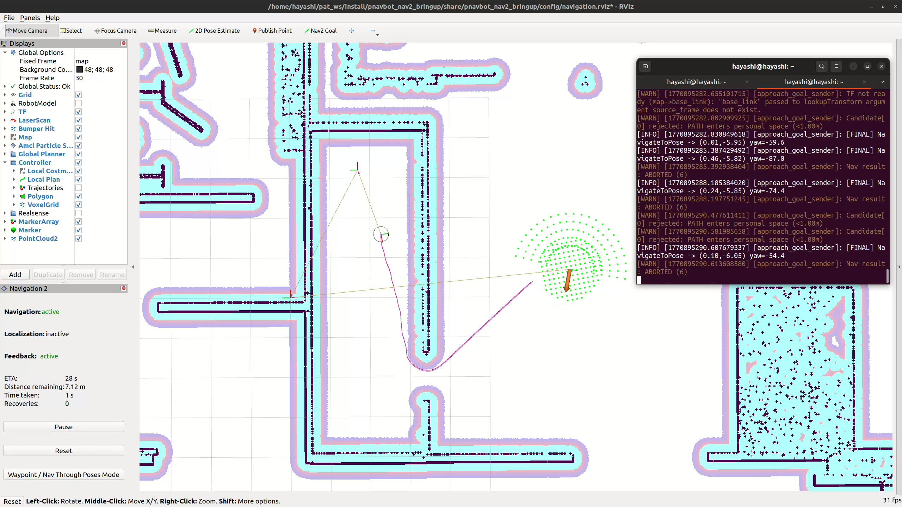
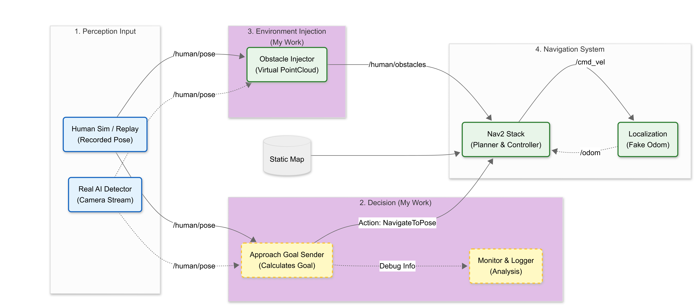
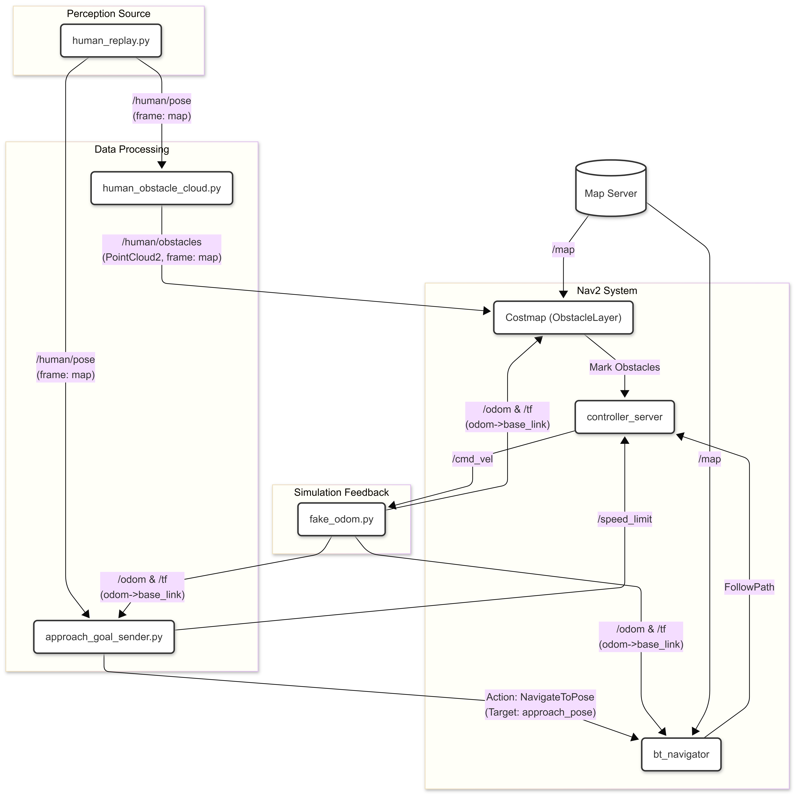

# Human-Aware Approach Navigation (ROS 2 + Nav2)

Human-aware navigation behavior for **approaching a person in a non-threatening way**:
- Approach from the **front-right** of the human
- Maintain a **safe distance (~1 m)**
- **Slow down** when close
- **Avoid moving behind** the human using an injected “virtual obstacle” zone

This repository is designed for **simulation / prototype validation** when full sensor simulation (e.g., LaserScan for AMCL) is not available yet. It uses:
- a **human pose replay** node (or replace with a real detector),
- **fake odometry / fake localization** for Nav2 motion in RViz,
- **PointCloud2 obstacle injection** into Nav2 local/global costmaps.

---

## Demo video

<video src="photo/navigation_approaching_behavior.mp4" controls="controls" style="max-width: 100%;">
</video>

---

## System Overview

### High-level architecture

### Detailed data flow

---

## Key Nodes

### 1) `human_replay.py` (Simulation human / replay)
Publishes a moving human pose:
- **Publish:** `/human/pose` (`geometry_msgs/PoseStamped`, frame: `map`)
- Optional:
  - `/human/marker` for RViz visualization
  - TF: `map -> human_*` for debugging

You can replace this node with a real detector later (camera-based pose estimation).

---

### 2) `human_obstacle_cloud.py` (Virtual obstacle injection)
Converts `/human/pose` into a **PointCloud2 obstacle** that Nav2 costmap can consume.

Two regions are published:
- **Filled disk** around the human (stop zone)
- **Behind wedge** region (avoid behind)

**Important:** The PointCloud frame must be **robot-mounted** (e.g., `base_link` or `base_scan`)
so Nav2 computes `obstacle_range` relative to the robot sensor origin.

- **Subscribe:** `/human/pose`
- **Publish:** `/human/obstacles` (`sensor_msgs/PointCloud2`, frame: `base_link` by default)

---

### 3) `approach_goal_sender.py` (Human-aware goal selection)
Computes an approach target based on human pose:
- Generate candidates in **front-right sector**
- Optionally validate with `ComputePathToPose` to reject paths that go behind
- Send final goal with **Nav2 NavigateToPose action**
- Optional speed limiting near human (topic: `/speed_limit`)

---

### 4) `fake_odom.py` (Fake localization / odometry)
When no real localization is available (no LaserScan → no AMCL), this node provides:
- `/odom` and `/tf` (`odom -> base_link`) computed from `/cmd_vel`

This makes Nav2 “move” on the map in RViz to validate the approach logic.

---

## Why Fake Localization?

Normally, a full navigation stack needs:
- `/scan` (LaserScan) or equivalent
- AMCL (or SLAM localization)

But in this environment, there is **only a static map** and **no simulated laser scan**.
So we use **fake odometry** to test:
- goal selection logic
- approach constraints (front-right, 1m distance)
- dynamic obstacle avoidance behavior

This is a **prototype strategy** to validate the algorithm first, before integrating full sensors.

---

## Requirements

- ROS 2 (recommended: **Humble**)
- Nav2 installed
- TF tree available: `map -> odom -> base_link` (or produced by fake localization)
- RViz2

> If you use Gazebo / Unreal / custom sim later, replace `fake_odom.py` and/or `human_replay.py`.

---

## Repository Structure (expected)

